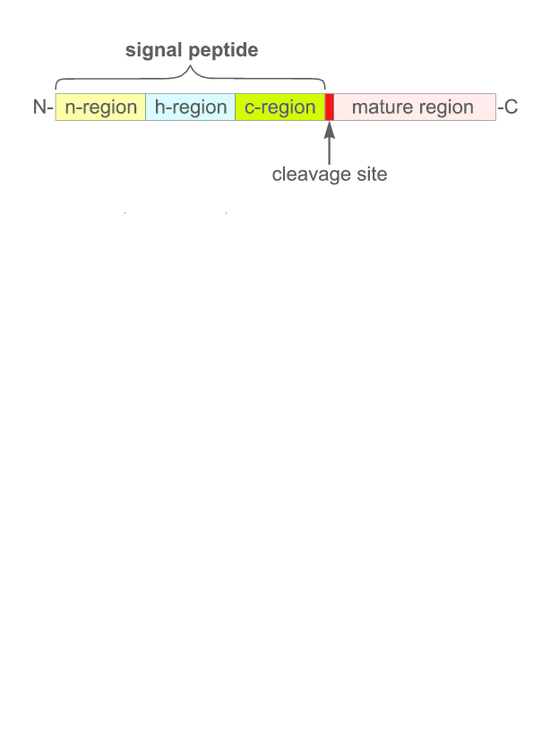

```{r, echo = FALSE, message = FALSE, results='asis',warning=FALSE}
library(DT)
library(knitr)
library(ggplot2)
library(grid)
library(gridExtra)
library(dplyr)
library(biogram)
library(reshape2)
library(plotly)
library(shiny)

options(DT.options = list(iDisplayLength = 6, searching = TRUE))

size_mod <- -1

enc2df <- function(x)
  data.frame(Nazwa = names(x), Elementy = toupper(sapply(x, paste0, collapse = ", ")))

my_theme <- theme(
  axis.text = element_text(size=13 + size_mod),
  axis.title.x = element_text(size=14 + size_mod, vjust = -1),
  axis.title.y = element_text(size=14 + size_mod, vjust = 1),
  
  legend.background = element_rect(fill = "NA"),
  legend.key = element_rect(fill = "NA", color = "NA", size = 0.5),
  legend.position = "bottom",
  #uncomment for publications
  legend.key.size = unit(0.1, "inches"),
  legend.margin = unit(-0.25, "lines"),
  legend.text = element_text(size=13 + size_mod), 
  legend.title = element_text(size=15 + size_mod),
  
  panel.grid.major = element_line(color="grey", linetype = "dashed", size = 0.5),
  panel.grid.major = element_line(color="lightgrey", 
                                  linetype = "dashed", size = 0.5),
  panel.background = element_rect(fill = "transparent", color = "black"),
  
  plot.background=element_rect(fill = "transparent",
                               color = "transparent"),
  #uncomment for publications
  plot.margin = unit(rep(0.2, 4), "inches"),
  plot.title = element_text(size=20 + size_mod),
  
  strip.background = element_rect(fill = "NA", color = "NA"),
  strip.text = element_text(size=13 + size_mod, face = "bold")
)
```

## Bioinformatyczne przewidywanie funkcji białek

Prace eksperymentalne zazwyczaj poprzedza się analizami komputerowymi, które pozwalają optymalniej zaprojektować dalsze badania.

Przykłady:   

* przewidywanie lokalizacji subkomórkowej białek (sygnałów kierujących),  
* predykcja struktury drugorzędowej i trzeciorzędowej białek oraz kwasów nukleionowych,
* przewidywanie miejsc wiązania czynników transkrypcyjnych,
* poszukiwanie sekwencji kodujących białko.

<!-- Taniej, szybciej -->

## Białka amyloidowe

Białka związane z licznymi chorobami (np. choroby Alzheimera, Parkinsona, Creutzfeldta-Jakoba) tworzące szkodliwe agregaty.

## Hot spots

Proces ten jest inicjowany w obrębie tzw. hot spots, krótkich (6-15 aminokwasów) podsekwencji, które występują we wszystkich białkach amyloidowych i formują specyficzne struktury $\beta$ typu "zamka błyskawicznego" (zipper-like).

Zróżnicowanie budowy hot spots uniemożliwa opisanie ich konkretnych wzorcem, a w konsekwencji predykcję potencjalnych miejsc inicjacji agregacji amyloidowej w białku. 

## Cel pracy doktorskiej

Opracowanie interpretowalnych metod przewidywania właściwości sekwencji biologicznych.

Wybrany problem: przewidywanie białek amyloidogennych.

Motywacja:  

* rola białek amyloidogennych w chorobach neurodegeneratywnych,  
* niska precyzja innych programów przewidujących białka amyloidowe,  
* trudno interpretowalne reguły decyzyjne wykorzystywane przez inne programy.  

## Programy przewidujące lokalizację hot spots

Istnieją już programy przewidujące miejsca inicjacji agregacji, ale ich precyzja nie jest wysoka. Dodatkowo, wykorzystywane przez nie reguły decyzyjne są trudno interpretowalne.

<!-- ## Peptydy sygnałowe -->

<!-- Peptydy sygnałowe to krótkie (15-30 aminokwasów) N-końcowe sekwencje kierujące białko do sekrecji. -->

<!-- Powszechny model klasycznych peptydów sygnałowych zakłada, że rozpoczynają się one naładowanym dodatnio n-regionem, po którym występuje hydrofobowy h-region i c-region zakończony miejscem cięcia rozpoznawanym przez peptydazę sygnałową.  -->

<!-- ## Peptydy sygnałowe -->

<!--  -->

<!-- ## Peptydy sygnałowe -->

<!-- Analizy dużej liczby sekwencji reprezentujących szerokie spektrum zróżnicowanych taksonomicznie gatunków wskazują na dużą zmienność peptydów sygnałowych. -->

## n-gramy

Przykładowe sekwencje. S - sekwencja, P - pozycja. 

```{r, echo = FALSE, message = FALSE, results='asis',warning=FALSE}
library(seqinr)
aa_v <- seqinr::a()[-1]
set.seed(1)
sample_seq <- matrix(sample(aa_v, 18, replace = TRUE), nrow = 3)
colnames(sample_seq) <- paste0("P", 1L:ncol(sample_seq))
rownames(sample_seq) <- paste0("S", 1L:nrow(sample_seq))
sample_seq_dat <- data.frame(sample_seq)

renderDataTable(datatable(sample_seq_dat, 
                          rownames = TRUE, filter = "none", 
                          options = list(dom = 't')))
```

```{r, echo = FALSE}
shinyApp(
  
  ui = fluidPage(
    fluidRow(column(3, sliderInput("ngram_n", "Długość n-gramu (n):", 
                                   min = 1,
                                   max = 5,
                                   step = 1,
                                   value = 1)),
             column(3, sliderInput("ngram_d", "Długość przerw:", 
                                   min = 0,
                                   max = 3,
                                   step = 1,
                                   value = 0))
    ),
    
    uiOutput("ngram_names"),
    uiOutput("vector_ngrams")
  ),
  
  server = function(input, output) {
    output$ngram_names <- renderUI({
      h2(paste0("Przykładowe ", input[["ngram_n"]], "-gramy (przerwa ", input[["ngram_d"]], ")"))
    })
    
    output$vector_ngrams <- renderUI({
      h2(paste0(paste0(gsub("_", "-", decode_ngrams(seq2ngrams(sample_seq, input[["ngram_n"]], aa_v, 
                                                               d = input[["ngram_d"]])[1L:3])),
                       collapse = ", "), ", ..."))
    })
  }
)
```


## Problemy analizy n-gramowej

n-gramy tworzą bardzo duże i trudne do analizy zbiory danych.

```{r, echo = FALSE, message = FALSE, results='asis',warning=FALSE}
shinyApp(
  
  ui = fluidPage(
    sliderInput("ngram_m", "Długość alfabetu:", 
                                   min = 1,
                                   max = 20,
                                   step = 1,
                                   value = 20),
    
    plotOutput("dim_curse")
  ),
  
  server = function(input, output) {
    output$dim_curse <- renderPlot({
      L <- 6
      m <- 20 
      m2 <- input[["ngram_m"]]
      n <- 1:6
      n_max <- L*m^n
      n_max2 <- L*m2^n
      dat <- data.frame(n = c(n, n), n_max = c(n_max, n_max2), m = c(rep(m, 6), rep(m2, 6)))
      dat[["m"]] <- factor(dat[["m"]])
      
      ggplot(dat, aes(x = n, y = n_max, color = m)) + 
        geom_line(linetype="dotted", size=1.5) + 
        geom_point(size=7, shape=21) +
        scale_x_continuous("n", breaks = 0L:6) +
        scale_y_continuous("Całkowita liczba n-gramów") +
        scale_color_discrete("m (długość alfabetu)") +
        my_theme
    })
  }
)

```

## Redukcja wymiarów - zmniejszenie alfabetu

W przypadku alfabetu aminokwasowego zmniejszenie wielkości alfabetu skutkuje mniejszą liczbą potencjalnych n-gramów.

$n_{\text{max}} = L \times m^n$

$n_{\text{max}}$: liczba n-gramów.  
$L$: długość sekwencji.  
$m$: wielkość alfabetu.  
$n$: długość n-gramu.

## Redukcja wymiarów - wybór n-gramów

n-gramy filtrowane są zwykle przy wykorzystaniu testów permutacyjnych. 

Podczas testu permutacyjnego oznaczenia klas są losowo mieszane, a uzyskaną wartość danej statystyki (w tym przypadku information gain) porównuje się z wartością tej statystyki dla danych oryginalnych.  

Testy permutacyjne są bardzo wymagające obliczeniowo, dlatego też opracowałem Quick Permutation Test, który pozwala wielokrotnie szybciej filtrować n-gramy.


## Amyloidy - redukcja alfabetu

Stworzono 524 284 zredukowane alfabety o różnych długościach (od trzech do sześciu grup) wykorzystując metodę grupowań Warda na wybranych cechach fizykochemicznych z basy AAIndex.

## Najlepsze kodowanie

```{r, echo = FALSE, message = FALSE, results='asis',warning=FALSE}
datatable(enc2df(list(`1` = "g", 
                      `2` = c("k", "p", "r"), 
                      `3` = c("i", "l", "v"), 
                      `4` = c("f", "w", "y"), 
                      `5` = c("a", "c", "h", "m"), 
                      `6` = c("d", "e", "n", "q", "s", "t"))), 
          rownames = FALSE, filter = "none", 
          options = list(dom = 't')) 
```

Przykładowo: GKRID -- 12236.

## Najlepsze kodowanie

```{r, echo = FALSE, message = FALSE, results='asis',warning=FALSE}
datatable(enc2df(list(`1` = "g", 
                      `2` = c("k", "p", "r"), 
                      `3` = c("i", "l", "v"), 
                      `4` = c("f", "w", "y"), 
                      `5` = c("a", "c", "h", "m"), 
                      `6` = c("d", "e", "n", "q", "s", "t"))), 
          rownames = FALSE, filter = "none", 
          options = list(dom = 't')) %>% 
  formatStyle(
    'Elementy',
    backgroundColor = styleEqual("K, P, R", 'aquamarine')
  )
```

Aminowaksy K, P, R nie powinny występować w obrębie hot spots [@paz_sequence_2004].

## Najlepsze kodowanie

```{r, echo = FALSE, message = FALSE, results='asis',warning=FALSE}
datatable(enc2df(list(`1` = "g", 
                      `2` = c("k", "p", "r"), 
                      `3` = c("i", "l", "v"), 
                      `4` = c("f", "w", "y"), 
                      `5` = c("a", "c", "h", "m"), 
                      `6` = c("d", "e", "n", "q", "s", "t"))), 
          rownames = FALSE, filter = "none", 
          options = list(dom = 't')) %>% 
  formatStyle(
    'Elementy',
    backgroundColor = styleEqual("K, P, R", 'aquamarine')
  )
```

Najlepsze kodowanie wykorzystano do wyuczenia programu AmyloGram, opartego na n-gramach predyktora amyloidogenności.

## Informatywne n-gramy

```{r, echo = FALSE, message = FALSE, results='asis',warning=FALSE,fig.width=10}
ngram_freq <- read.csv("ngram_freq.csv") %>% 
  mutate(amyloid = diff_freq > 0) %>%
  select(decoded_name, amyloid, association) %>% 
  filter(!duplicated(.))

ngram_freq_plot <- table(ngram_freq[["association"]], ngram_freq[["amyloid"]]) %>% 
  melt %>% 
  rename(association = Var1, pred = Var2) %>% 
  mutate(association = factor(association, labels = c("Amyloidogenny", "Nieamyloidogenny", "Niesprawdzony")),
         pred = factor(pred, labels = rev(c("Amyloidogenny", "Nieamyloidogenny"))))
my_dodge <- position_dodge(1)

ggplot(ngram_freq_plot, aes(fill = pred, y = value, x = association, label = value)) +
  geom_bar(stat = "identity", position = my_dodge) +
  geom_text(position = my_dodge, vjust = -0.5) +
  scale_x_discrete("Dane eksperymentalne\n") +
  scale_y_discrete("Liczba n-gramów") +
  coord_cartesian(ylim = c(0, 30)) +
  scale_fill_manual("Predykcja AmyloGram", values = c("darkmagenta", "cadetblue")) +
  my_theme 

```

## Benchmark

```{r, echo = FALSE, message = FALSE, results='asis',warning=FALSE}
benchmark_dat <- structure(list(classifier = structure(c(4L, 3L, 1L, 2L), 
                                                       .Label = c("appnn", "class14592_10", "FoldAmyloid", "PASTA2"),
                                                       class = "factor"), 
                                AUC = c(0.854996271439225, 0.735098185433756, 
                                        0.834302759134974,  0.897153865274671), 
                                MCC = c(0.429123592940917, 0.45255292317694, 
                                        0.582260193831285, 0.630749412736651), 
                                pos = c(NA, NA, NA, 10L), 
                                nice_name = structure(c(4L, 3L, 2L, 1L), 
                                                      .Label = c("14592", "appnn", "FoldAmyloid", "PASTA2"), 
                                                      class = "factor")),
                           .Names = c("classifier", "AUC", "MCC", "pos", "nice_name"), 
                           row.names = c(1L, 2L, 3L, 5L), class = "data.frame")

benchmark_dat %>% 
  mutate(classifier = as.character(classifier)) %>% 
  mutate(classifier = ifelse(classifier == "class14592_10", "AmyloGram", classifier)) %>% 
  rename(Software = classifier) %>% 
  select(1L:5) %>% 
  datatable(rownames = FALSE, filter = "none", 
            options = list(dom = 't')) %>% 
  formatRound(2L:3, 4) %>% 
  formatStyle(
    'AUC',
    backgroundColor = styleInterval(c(0.897, 1), c('white', 'aquamarine', 'white'))
  ) %>%
  formatStyle(
    'MCC',
    backgroundColor = styleInterval(c(0.63, 1), c('white', 'aquamarine', 'white'))
  )

```

Porównanie AmyloGramu z APPNN [@familia_prediction_2015], PASTA2 [@walsh_pasta_2014] i FoldAmyloid [@garbuzynskiy_foldamyloid:_2010].

## Podsumowanie

Analiza metodami n-gramowymi pozwala na precyzyjniejsze przewidywanie właściwości sekwencji aminokwasowych.

[AmyloGram](www.smorfland.uni.wroc.pl/amylogram)  
[signalHsmm](www.smorfland.uni.wroc.pl/signalHsmm)

## Perspektywy dalszych badań

* Opracowanie predykcji bakteryjnych peptydów sygnałowych.  
* Analiza n-gramów pochodzących z genomów mitochondrialnych różnych grup taksonomicznych.

## References